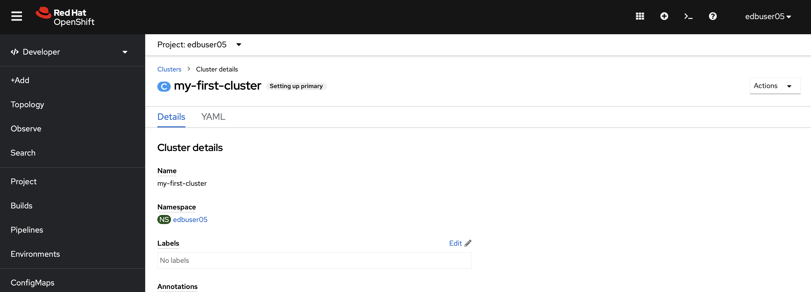
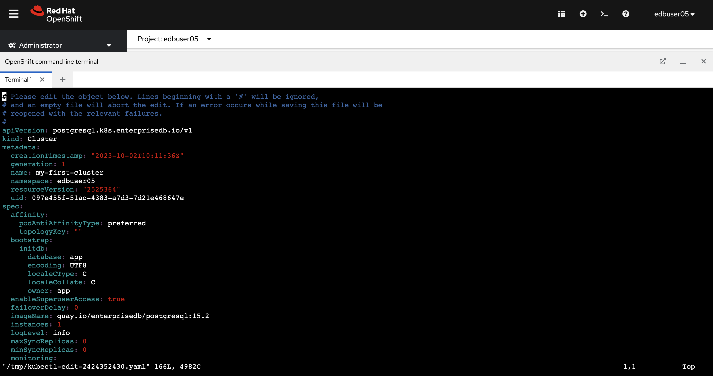
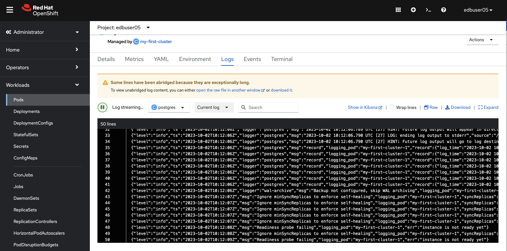
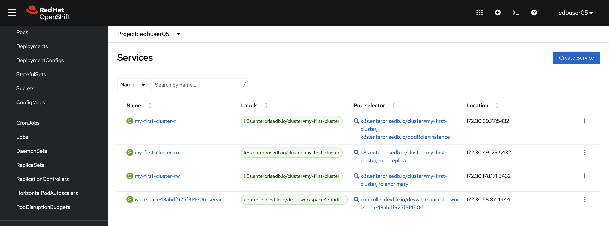

# Chapter one: getting started with a simple database

## Topics

1. Introduction
2. Lab infrastructure
3. The first steps
4. Exploring the cluster at the Kubernetes level
5. Exploring the cluster at the Postgres level
6. Clean up
10. Some important links

## 1. Introduction
Welcome to the Postgres on Kubernetes workshop based on the cloud-native Postgres
operator. During this workshop, we'll introduce you to all the concepts and technologies
required to run a production-ready Postgres cluster on Kubernetes.

## 2. Lab infrastructure
This lab is meant to run on a ROSA (Red Hat OpenShift on AWS) Kubernetes cluster. The
following URLs are important for this lab:

 - sign-up / username sheet: 
 - OpenShift console: 
 - [Postgres cheatsheet](https://www.postgresqltutorial.com/postgresql-cheat-sheet/)

The ROSA cluster is made up of three x86_64 EC2 worker nodes. 

## 3. The first steps
Like of any database cluster, the purpose of a Postgres cluster on Kubernetes is to
provide access to important data from applications that connect to it.

In order to make that data available at all times, Postgres clusters are made up of
a single primary (writable) node, and multiple replicas (read-only). When the primary
fails (for whatever reason), the role of the primary can be moved to a replica. The new
primary becomes the single, writable instance in the cluster. This works on traditional
VM or physical machine based infrastructure as well as on Kubernetes.

Building a simple cluster with fail-over capabilities is where we will start our
journey.


Now, log into the OpenShift cluster by going to the URL mentioned in section 2 with your
designated edbuser. You must choose `htpasswd_provider` to get to the login screen. In the top of the left-hand navigation menu, make sure it reads
'Administrator'. If it reads 'Developer', click it and switch to the 'Administrator'
perspective.

Click 'Workloads' in the navigation menu, and then on 'Pods'. If you a get permission
error, make sure that the 'Project' menu at the top of the page displays the name of
your edbuser, so 'edbuser09', for example. Do not use the project called
'edbuserXX-tools just yet. We'll use that project later. The list of Pods should be
empty at this point.

In the top right of the screen, click the >_ symbol, and choose edbuserXX as the project. This will
start a web-based terminal in your browser to interact with the OpenShift Kubernetes
cluster, without you having to install anything on your laptop. 

Starting the terminal will take a minute or so the first time. When it is done, the list
of pods should have a single entry that starts with 'workspace'.


In the terminal, type `kubectl cnp version` or `oc cnp version`. The result of this
command should be similar to
```
Build: {Version:1.20.2 Commit:c42ca1c2 Date:2023-07-28}
```

If not, please contact your instructor.

The `kubectl cnp` command calls a plugin for `kubectl` or `oc` (the Kubernetes and
OpenShift command-line interfaces, respectively) to interact with Postgres clusters on
Kubernetes. We will be using it often during this course. You can minimize the web
terminal with the _ symbol in the top right corner.

From this point on, we'll use `kubectl` in our examples, but feel free to use `oc` and
save a few characters on every command. Just type `oc` where we use `kubectl` and all
will work just fine.

In the left hand-menu, switch from the 'Administrator' perspective to the 'Developer'
perspective (by clicking on 'Administrator') and in the Developer perspective menu,
select '+Add'.

On the next page, select 'Import YAML' under 'From Local Machine'.

In the input screen that opens, paste the following code:

```yaml
apiVersion: postgresql.k8s.enterprisedb.io/v1
kind: Cluster
metadata:
  name: my-first-cluster
spec:
  instances: 1
  imageName: quay.io/enterprisedb/postgresql:15.2
  storage:
    size: 1Gi
```

and hit 'Create'. 

 operator. We'll create more complex topologies later.




In the web terminal, you can type `kubectl cnp status my-first-cluster`. When your
cluster is ready, the output of that command should show 'Cluster in healthy state' in
green at the top of the output.

## 4. Exploring the cluster at the Kubernetes level

### Storage
Let's explore what the components of our single node Postgres cluster are. First, let's look at where the database stores it's data.

In the 'Administrator' perspective, select the 'Storage' menu, and the
'PersistentVolumeClaims'. There should be a 1Gi-sized physical volume claim listed here called 'my-first-cluster-1'. This physical volume claim (PVC) defines that our database pod owns a certain block device. The PVC refers to a physical volume that represents the actual actual block device (disk). The PV is mounted to the pod our database runs at `/var/lib/postgresql/data`.

Note that the CNPG operator has take care of everything! We defined a single volume of 1Gi for our database, and that is exactly what we received!


### Cluster YAML
Next, in the web terminal, type `kubectl edit cluster my-first-cluster` and scroll
through the YAML that you'll now see. This YAML defines all aspects of our cluster.
You'll note that it's much longer than the YAML we used to define the cluster. That is
because many parameters were set for our cluster by the CNPG operator with their default
values. 

Look for a section called 'parameters'. These are so-called GUCs, Postgres configuration
parameters, that are also configurable through the operator. Changing or adding
a Postgres configuration parameter in the cluster YAML will set that parameter for the
whole cluster. You won't have to do so much as restart the databases: everything is
fully automated. In fact, changing a parameter will not restart the databases, but just
reload the configuration files, which is much faster and unnoticable from an enduser
point of view.



### Pods
On to the pods. Click 'Workloads' in the left-hand menu, and then 'Pods'. Click the
`my-first-cluster-1` Pod. You can see the whole Pod definition here, including the
console logs generated by the Pod. 

Leaving the 'Logs' tab open and open your web terminal. Type the following command:
```kubectl exec -it my-first-cluster-1 -- pg_ctl reload```
This command will reload your database configuration files, and show make a message
similar to this show up in the pod console log (rerun the command a couple of times if
you fail to notice the message):

```json
{"level":"info","ts":"2023-09-29T20:57:38+02:00","logger":"postgres","msg":"record","logging_pod":"my-first-cluster-1","record":{"log_time":"2023-09-29 20:57:38.282 CEST","process_id":"22","session_id":"6501a0c5.16","session_line_num":"9","session_start_time":"2023-09-13 13:45:09 CEST","transaction_id":"0","error_severity":"LOG","sql_state_code":"00000","message":"received SIGHUP, reloading configuration files","backend_type":"postmaster","query_id":"0"}}
```

This is already nice: being able to see our Postgres logs this easily and remotely, but
we can do better. Towards the end of this workshop, we'll look at how we can pull all
Postgres logs into a central logging console and filter through them.



### Services and routes
Our next stop is the services menu. Click 'Networking' in the left-hand menu, and select
'Services'.

Notice that you see three services there:

- my-first-cluster-rw
- my-first-cluster-ro
- my-first-cluster-r

Services are what other applications in the same Kubernetes cluster use to connect to
your database. Think of them as simple loadbalancers. Each of these services offers
access to a different group of Postgres servers in your cluster (forget for one second
we only have a single Pod for a second!).

From top to bottom: the `my-first-cluster-rw` service offers access to the primary only.
This is for applications that need to write to your database.

The `my-first-cluster-ro` service gives applications access to your replicas (if you
have them). Applications that just want to read from your database should be pointed to this service. Because this service load balances over multiple replicas (if available), you can add more replicas and automatically add more read-only query capacity to your cluster, which is quite handy for some OLAP workloads.



Services only work within the same Kubernetes cluster. If you want to expose your
database to an application that runs outside of your Kubernetes cluster, you need to
create an Ingress or, on OpenShift, a Route. 

Check the 'Route' menu (it's right underneath 'Services' in the left-hand menu) to see
that no Ingress or Route objects have been created by the CNPG operator. This is by
design: we do not expose your database outside of the cluster without you expicitly
configuring that.

## Secrets
Finally, either by clicking 'Workloads' and then 'Secrets' in the left-hand menu, or by
running `kubectl get secrets` in the web terminal, take a look at the secrets that are
created by the 

In the web terminal, you should see a list similar to this:

```
NAME                            TYPE                                  DATA   AGE
default-token-frcdp             kubernetes.io/service-account-token   3      2m
my-first-cluster-ca             Opaque                                2      2m
my-first-cluster-server         kubernetes.io/tls                     2      2m
my-first-cluster-replication    kubernetes.io/tls                     2      2m
my-first-cluster-superuser      kubernetes.io/basic-auth              3      2m
my-first-cluster-app            kubernetes.io/basic-auth              3      2m
my-first-cluster-token-krjzx    kubernetes.io/service-account-token   3      2m
```

The secrets of type `kubernetes.io/tls` are the secrets where the CNPG operator stores
the SSL server certificate and the replication certificates. The server certificate is
used to verify the identity of the server for any connecting applications. The
replication certificates are used to secure replication between primary and replicas.

The secrets of type `kubernetes.op/basic-auth` are where the passwords for the
maintenance database (the database called `postgres`) and the application database
(called `app` by default) are stored.

You can see the password of the postgres user for the postgres database by running:

```bash
kubectl get secret my-first-cluster-superuser -o jsonpath='{.data.password}' | base64 --decode
```

Alternatively, you can click the secret in the OpenShift console and click 'Reveal'
above the hidden passwords.

One way of allowing your applications access to the database, is by copying the
`my-first-cluster-app` secret to the namespace / project your application runs in, and
mounting the secret in your application pods.

## 4. Exploring the cluster at the Postgres level
Ok, now let's look at the cluster at the Postgres level. In order to have a little bit
more to look at, let's scale the cluster to two nodes first.

In the web terminal, run the following command:

```bash
kubectl scale cluster my-first-cluster --replicas=2
```

Yes, it is that easy to scale a Postgres cluster on Kubernetes. We tell Kubernetes we
want the cluster to now be two machines, the operator gets invoked and simply makes it
happen. No fuss!

You can follow progress by running `kubectl cnp status my-first-cluster` a couple of
times. It shouldn't take too long to get the 'Cluster is healthy' message at the top of the output again!

### Running psql
The cnp plugin for `kubectl` and `oc` has a builtin shortcut to connect to the database with the `psql` command. In order to connect to the primary database, just run:

```bash
kubectl cnp psql my-first-cluster -- -U postgres
```

Boom. We now have a connection to the primary of the cluster, and we're able to run SQL commands. Try some now. If you are new to Postgres, here are some things you can do.

Try running some meta commands and simple SQL to see this database is just like any
other Postgres database, just a bit more agile :)

```sql
\l
\c app
create table foo (id serial primary key, bar varchar(10) not null);
insert into foo (bar) values ('baz');
select * from foo;
\d foo
```

All of these commands should work just fine, and will be replicated to the replica. You can verify by disconnecting (CTRL-D) running:

```sql
kubectl cnp psql --replica my-first-cluster
\c app
select * from foo;
```
The above commands will connect to the fist (and, in our case, only) replica and run the same query as we ran on the primary. We should get the same result.

In short, the CNPG operator just gave you automated and SSL-encrypted (hence, secure)
replication and high availabiltiy of your Postgres databases. How cool is that?

You can verify that the `psql` connection you set up in this section is to a primary or a replica by running the following query. If you can a 't', you are connected to
a replica, if you get an 'f', you are connected to the primary:

```sql
select pg_is_in_recovery();
```

## 5. Cleanup

Remove your cluster by using the web terminal. Type `kubectl delete cluster
my-first-cluster`. If you have the list of Pods open above your web terminal, you'll see the `my-first-cluster-1` pod disappear immediately. To check whether the cluster is really gone, type `kubectl cnp status my-first-cluster`.

## Additional documentation

- [EDB Postgres for
    Kubernetes](https://www.enterprisedb.com/docs/postgres_for_kubernetes/latest/)
- [Cloud-Native Postgres](https://cloudnative-pg.io/documentation/1.20/)

